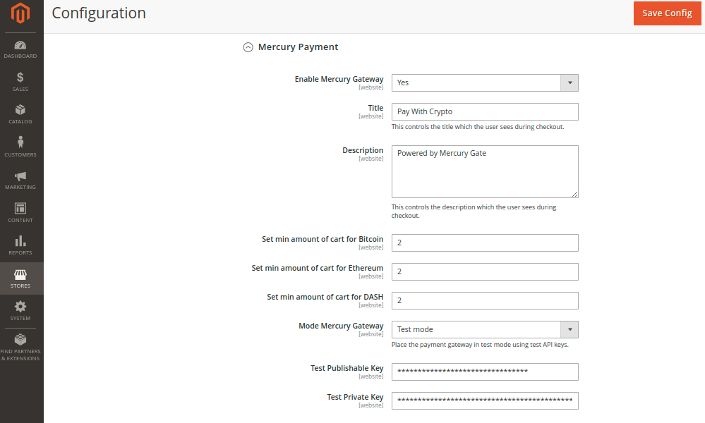

# Installation
#### Step-by-step to install the Magento 2 extension through Composer:
1. Locate your Magento 2 project root.

2. Install the Magento 2 extension using [Composer](https://getcomposer.org/)  
 ```bash 
 composer require mercurycash/gate-magentov2-plugin 
 ```

3. After installation is completed the extension:
 ```bash
# Enable the extension and clear static view files
 $ bin/magento module:enable Mercury_Payment --clear-static-content
 
 # Update the database schema and data
 $ bin/magento setup:upgrade
 
 # Recompile your Magento project
 $ bin/magento setup:di:compile
 
 # Clean the cache 
 $ bin/magento cache:flush
```
#### Manually (not recommended)
* Download the extension of the required version
* Unzip the file
* Create a folder ````{root}/app/code/Mercury/Payment````
* Copy the files this folder

#### Overview

Go to `Stores->Configuration->Sales->Payment Methods-> Tab Mercury Payment`


